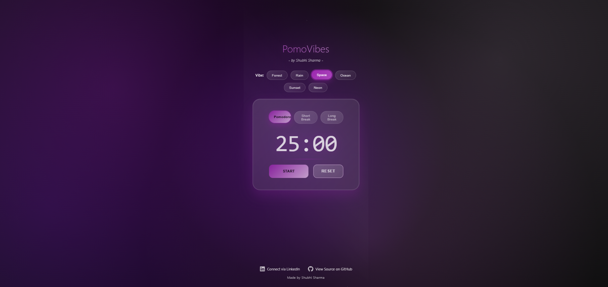
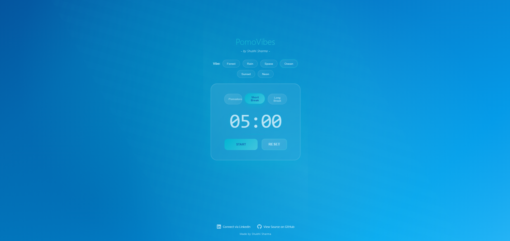
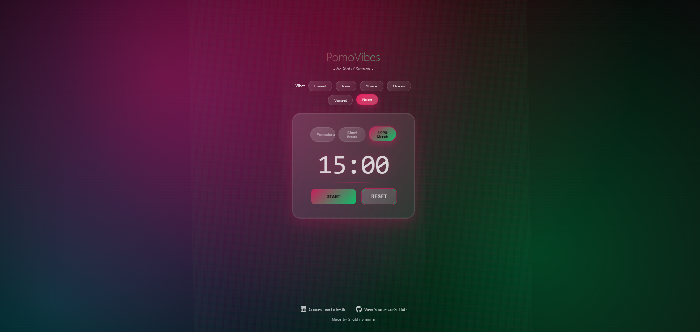

# PomoVibes ✨ - An Aesthetic Focus Timer


Welcome to Day 1 of the **#30DaysOfVibeCoding** challenge! PomoVibes is a minimalist Pomodoro timer designed to blend productivity with tranquility. It combines a functional focus clock with ambient animations, relaxing color themes, and soft background sounds to help you stay in the zone.

---

### 🚀 [**Live Demo on Vercel**](https://pomo-vibes.vercel.app/)






## 📝 Project Description

The goal of PomoVibes is to create a focus tool that you *want* to use. Instead of a sterile, generic timer, PomoVibes lets you choose your "vibe"—whether it's the calm of a forest, the gentle patter of rain, or the vastness of space. Each vibe changes the entire aesthetic of the application, from the color palette to the animated background and ambient sound, creating an immersive focus environment.

## 🌟 Core Features

- **Functional Pomodoro Timer**: Standard Work, Short Break, and Long Break cycles to structure your focus sessions.
- **Vibe Selector**: Choose from multiple "vibes" like Forest, Rain, Space, Ocean, and more.
- **Dynamic Color Themes**: The entire UI color palette instantly changes to match your chosen vibe.
- **Live Animated Backgrounds**: Built with `tsparticles` for beautiful, lightweight, and interactive background animations.
- **Ambient Background Sounds**: Optional, soft background sounds that match the vibe to help you tune out distractions.
- **Polished & Responsive UI**: A clean, "glassmorphism" design that looks great on both desktop and mobile devices.

## 💻 Tech Stack

- **Framework**: [React](https://reactjs.org/) (with Vite for a lightning-fast build tool)
- **Styling**: Pure CSS with dynamic CSS Variables
- **Animations**: [Tsparticles](https://particles.js.org/) for interactive particle animations
- **Icons**: [React Icons](https://react-icons.github.io/react-icons/)
- **Deployment**: [Vercel](https://vercel.com/)

## 🚀 Getting Started

To get a local copy up and running, follow these simple steps.

### Prerequisites

You need to have [Node.js](https://nodejs.org/en/) and [npm](https://www.npmjs.com/) installed on your machine.

### Installation & Setup

1.  **Fork the repository** by clicking the 'Fork' button on the top right of the page.
2.  **Clone your forked repository** to your local machine.
    ```bash
    git clone https://github.com/shvbhii/PomoVibes.git
    ```
   

3.  **Navigate to the project directory.**
    ```bash
    cd pomovibes
    ```

4.  **Install NPM packages.**
    ```bash
    npm install
    ```

5.  **Run the development server.**
    ```bash
    npm run dev
    ```
    The app will be available at `http://localhost:5173/`.

## 🤝 How to Contribute

Contributions are what make the open-source community such an amazing place to learn, inspire, and create. Any contributions you make are **greatly appreciated**.

1.  Fork the Project
2.  Create your Feature Branch (`git checkout -b feature/AmazingFeature`)
3.  Commit your Changes (`git commit -m 'Add some AmazingFeature'`)
4.  Push to the Branch (`git push origin feature/AmazingFeature`)
5.  Open a Pull Request

You can also contribute by reporting bugs or suggesting new features. Please open an issue via the [Issues tab](https://github.com/your-username/pomovibes/issues).

## 🧑‍💻 Creator & Connect

This project was brought to life by **Shubhi Sharma** as part of a personal coding challenge. Let's connect!

- **LinkedIn**: [www.linkedin.com/in/shvbhi](https://www.linkedin.com/in/shvbhi)
- **GitHub**: [github.com/your-username](https://github.com/your-username)
<!-- Replace "your-username" with your GitHub username -->

## 📄 License

Distributed under the MIT License. See `LICENSE` for more information.

---